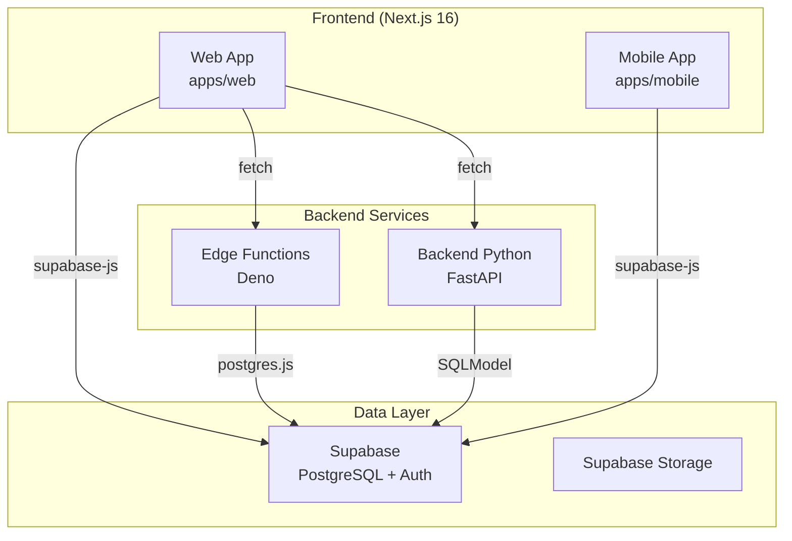
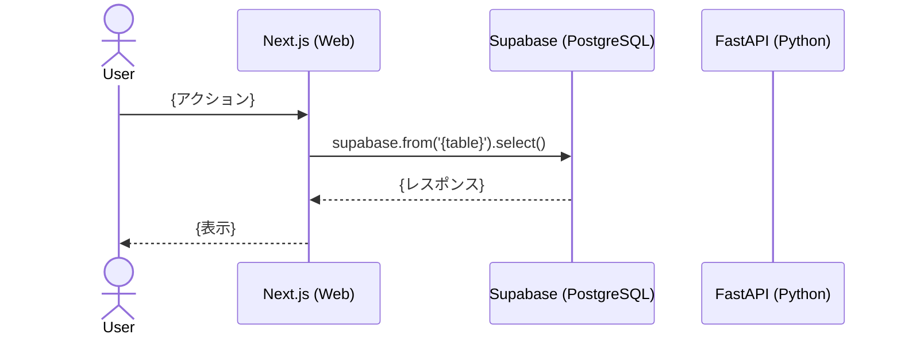

# {Feature Name} - アーキテクチャ設計

<!--
  出力先: docs/designs/{feature-name}/architecture.md
  システム全体の構成とデータフローを定義する。
  Mermaid図を活用して視覚的に表現する。
-->

[< README.md](./README.md) | [data-model.md >](./data-model.md)

## システム構成図

<!--
  この機能に関わるコンポーネント間の関係を Mermaid で図示する。
  既存システムとの接続点を明確にする。
-->



<!--
  上記は全体像のテンプレート。
  機能固有のコンポーネントを追加・削除し、データの流れを矢印で示す。
-->

## Frontend アーキテクチャ (FSD)

<!--
  Feature Sliced Design に基づくレイヤー配置を定義する。
  参照: .claude/skills/fsd/SKILL.md

  レイヤー階層: App > Views > Widgets > Features > Entities > Shared
  インポートルール: 下位レイヤーへのみインポート可能
-->

### レイヤー配置

```
frontend/apps/web/src/
├── views/{feature-name}/
│   ├── ui/
│   │   └── {FeatureName}Page.tsx
│   └── index.ts
├── widgets/{widget-name}/
│   ├── ui/
│   │   └── {WidgetName}.tsx
│   └── index.ts
├── features/{feature-name}/
│   ├── ui/
│   │   └── {Component}.tsx
│   │   └── {Component}.stories.tsx
│   ├── api/
│   │   └── {action}.ts
│   ├── model/
│   │   ├── types.ts
│   │   ├── hooks.ts
│   │   └── hooks.test.ts
│   └── index.ts
├── entities/{entity-name}/
│   ├── ui/
│   │   └── {EntityComponent}.tsx
│   │   └── {EntityComponent}.stories.tsx
│   ├── api/
│   │   └── queries.ts
│   ├── model/
│   │   ├── types.ts
│   │   └── store.ts
│   └── index.ts
└── shared/
    ├── ui/         # 共通UIコンポーネント
    ├── lib/        # ユーティリティ
    └── config/     # 設定
```

### FSD スライス一覧

<!-- この機能で追加/変更するスライスを列挙 -->

| レイヤー | スライス | 責務 | 新規/既存 |
|---------|---------|------|----------|
| entities | {entity} | {責務} | 新規 |
| features | {feature} | {責務} | 新規 |
| widgets | {widget} | {責務} | 新規 |
| views | {view} | {責務} | 新規 |

### Public API 設計

<!--
  各スライスの index.ts で公開するAPIを定義する。
  FSD の Public API パターンに従い、実装詳細を隠蔽する。
-->

```typescript
// entities/{entity}/index.ts
export { use{Entity} } from './model/hooks'
export type { {Entity}, {Entity}Profile } from './model/types'
export { {Entity}Card } from './ui/{Entity}Card'
```

## Backend アーキテクチャ (Clean Architecture)

<!--
  FastAPI の Clean Architecture に基づく層構造。
  参照: .claude/rules/backend-py.md

  構造:
  - controller/  -> HTTP request/response のみ
  - usecase/     -> ビジネスロジック
  - gateway/     -> データアクセスインターフェース
  - domain/      -> エンティティ、モデル
  - infra/       -> 外部システム接続

  この機能で Backend が不要な場合:
  N/A -- この機能では Backend Python は使用しない
-->

### 層構造

<!-- この機能でBackend APIが必要な場合のみ記述 -->

```
backend-py/apps/api/src/api/
├── controller/{feature}/
│   └── router.py          # HTTP エンドポイント
├── usecase/{feature}/
│   └── {use_case}.py      # ビジネスロジック
├── gateway/{feature}/
│   └── {gateway}.py       # データアクセスインターフェース
└── infra/{feature}/
    └── {repository}.py    # 外部システム接続
```

### Supabase-First 判定

> **判定テーブルは [api.md](./api.md) の「Supabase-First 判定」セクションに記載。** ここでは記載しない。
>
> 判定階層（詳細: `.claude/rules/supabase-first.md`）:
> 1. supabase-js (DEFAULT) — CRUD + RLS で十分な場合
> 2. Edge Functions — Webhook、service_role 必要時
> 3. Backend Python (LAST RESORT) — 複雑なロジック、AI/ML

## Edge Functions

<!-- この機能でEdge Functionsが必要な場合のみ記述。不要な場合は N/A と記載。 -->

```
supabase/functions/
├── {function-name}/
│   └── index.ts
└── _shared/
    ├── drizzle/     # Drizzle スキーマ（自動コピー）
    └── supabase.ts  # Supabase クライアント
```

## データフロー

<!--
  主要なユースケースのデータフローをシーケンス図で表現する。
-->

### ユースケース: {主要なフロー}



## 状態管理

<!--
  状態管理の詳細設計は ui-ux.md に記載。
  ここでは概要のみ示す。

  役割分担:
  - ローカルUI状態: useState
  - グローバル共有状態: Zustand
  - サーバー状態: TanStack Query

  -> 詳細は [ui-ux.md](./ui-ux.md) の「状態管理設計」セクションを参照
-->

| 状態 | 種別 | 管理方法 | 格納場所 |
|------|------|---------|---------|
| {状態1} | サーバー状態 | TanStack Query | entities/{entity}/api/ |
| {状態2} | グローバル共有 | Zustand | entities/{entity}/model/store.ts |
| {状態3} | ローカルUI | useState | features/{feature}/ui/ |

## パッケージ依存

<!-- この機能で追加が必要なパッケージ -->

| パッケージ | 用途 | インストール先 |
|-----------|------|--------------|
| {package} | {用途} | frontend/apps/web |

## 設計判断の根拠

<!--
  なぜこのアーキテクチャを選択したか。
  トレードオフと代替案を記述する（Google Design Doc スタイル）。
-->

### 判断1: {決定事項}

- **選択**: {選択した方法}
- **理由**: {理由}
- **代替案**: {代替案とその棄却理由}
