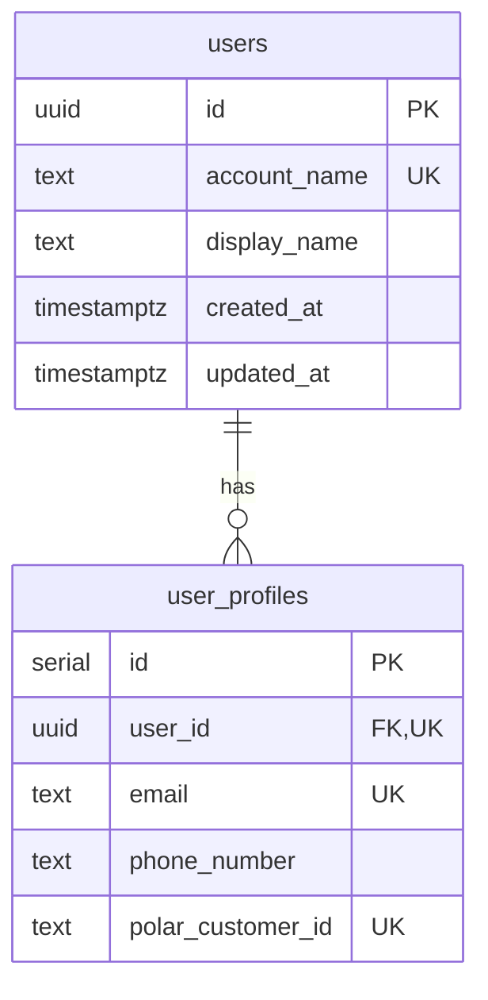

# {Feature Name} - データモデル設計

<!--
  出力先: docs/designs/{feature-name}/data-model.md
  最重要セクション。データベーススキーマ、RLS、マイグレーション戦略を定義する。

  必須参照:
  - .claude/rules/database.md - スキーマ設計ルール
  - .claude/rules/datetime.md - 日時設計ルール
  - .claude/skills/drizzle/SKILL.md - Drizzle ORM パターン
  - drizzle/schema/schema.ts - 既存スキーマのパターン
  - drizzle/schema/types.ts - 既存 Enum 定義
-->

[< architecture.md](./architecture.md) | [api.md >](./api.md)

## データ分類マトリクス

<!--
  各テーブル/カラムのデータ分類を定義する。
  この分類はRLSポリシー設計とPII分離設計の基礎となる。

  分類基準:
  - public: 誰でもアクセス可能（プロフィール名、公開設定等）
  - internal: 認証ユーザーのみ（内部メタデータ等）
  - confidential: 本人のみ（メールアドレス、電話番号等）
  - restricted: システム管理者のみ（決済ID、APIキー等）
-->

| テーブル | カラム | 分類 | 理由 |
|---------|--------|------|------|
| {table} | {column} | public / internal / confidential / restricted | {理由} |

## PII テーブル分離設計

<!--
  個人情報（PII: Personally Identifiable Information）を含むカラムは
  メインテーブルから分離して専用テーブルに配置する。

  既存パターン参照:
  - users テーブル: displayName, accountName (public)
  - user_profiles テーブル: email, phoneNumber, polarCustomerId (confidential/restricted)

  分離の判断基準:
  1. 法規制対象のデータ（GDPR, 個人情報保護法）-> 分離必須
  2. 決済・課金関連のID -> 分離必須
  3. 連絡先情報 -> 分離推奨
  4. 内部メタデータ -> 分離不要
-->

### 分離方針

| メインテーブル | 分離テーブル | 分離カラム | 理由 |
|--------------|------------|-----------|------|
| {main_table} | {pii_table} | {columns} | PII / 決済情報 |

### 分離パターン

```typescript
// メインテーブル: 公開情報のみ
export const {entities} = pgTable('{entities}', {
  id: uuid('id').primaryKey().defaultRandom(),
  name: text('name').notNull(),
  // ... 公開フィールドのみ
  createdAt: timestamp('created_at', { withTimezone: true, precision: 3 })
    .notNull().defaultNow(),
  updatedAt: timestamp('updated_at', { withTimezone: true, precision: 3 })
    .notNull().defaultNow(),
}).enableRLS()

// PIIテーブル: 機密情報を分離
// NOTE: PII分離テーブルは serial PK も許容（外部露出しないため）
//       メインテーブルとは userId FK + UNIQUE で 1:1 連携
export const {entity}Profiles = pgTable('{entity}_profiles', {
  id: serial('id').primaryKey(),
  {entity}Id: uuid('{entity}_id')
    .notNull().unique()
    .references(() => {entities}.id, { onDelete: 'cascade' }),
  email: text('email').notNull(),
  // ... 機密フィールド
}).enableRLS()
```

## マルチテナント設計

<!--
  テナント分離の方式を定義する。

  パターン:
  - B2C (user_id): 個人ユーザー単位でデータ分離
  - B2B (org_id): 組織単位でデータ分離
  - ハイブリッド: 組織内でユーザー別のアクセス制御

  選択した方式の理由を明記する。
-->

### テナント分離方式

| 方式 | 分離キー | RLS条件 | 適用テーブル |
|------|---------|---------|-------------|
| B2C | `user_id` | `(SELECT auth.uid()) = user_id` | {テーブル一覧} |
| B2B | `org_id` | `EXISTS (SELECT 1 FROM org_members ...)` | {テーブル一覧} |
| ハイブリッド | `org_id` + `role` | 組織メンバー + ロール検証 | {テーブル一覧} |

## ER図



<!--
  上記は既存テーブルの参考パターン。
  この機能で追加するテーブルとリレーションを定義する。
  既存テーブルへの参照がある場合は含める。
-->

## 日時設計

<!--
  必須参照: .claude/rules/datetime.md

  基本原則:
  - DB/Backend/API: すべて UTC で統一
  - Frontend: 入出力時にのみ UTC <-> ローカル変換
  - Drizzle: 必ず withTimezone: true, precision: 3 を指定
-->

### タイムスタンプルール

| レイヤー | タイムゾーン | 形式 |
|---------|------------|------|
| Database | UTC | `TIMESTAMP WITH TIME ZONE` |
| Backend | UTC | ISO 8601 文字列 |
| API Request/Response | UTC | ISO 8601 文字列 |
| Frontend | 入出力時にUTC<->ローカル変換 | `Date.toISOString()` / `Intl.DateTimeFormat` |

### Drizzle 定義ルール

```typescript
// 全タイムスタンプカラムに withTimezone: true, precision: 3 を必須で指定
createdAt: timestamp('created_at', { withTimezone: true, precision: 3 })
  .notNull().defaultNow(),
updatedAt: timestamp('updated_at', { withTimezone: true, precision: 3 })
  .notNull().defaultNow(),

// timestamp（without timezone）は禁止 -- タイムゾーン情報が失われる
```

### この機能の日時カラム一覧

| テーブル | カラム | 用途 | デフォルト |
|---------|--------|------|-----------|
| {table} | created_at | 作成日時 | `defaultNow()` |
| {table} | updated_at | 更新日時 | `defaultNow()` |
| {table} | {custom_at} | {用途} | {指定 or null} |

## Drizzle テーブル定義

<!--
  必須ルール（.claude/rules/database.md より）:

  PK設計ガイド:
  - 通常テーブル: uuid('id').primaryKey().defaultRandom()
  - auth.users連携テーブル: uuid('id').primaryKey()  (.defaultRandom() なし -- auth.users.id を受け取る)
  - PII分離テーブル: serial('id').primaryKey() も許容（外部露出しないため）
  - 外部ID連携: text('id').primaryKey()  (外部サービスのIDをそのまま使用)

  その他:
  - FK: .references(() => table.id, { onDelete: 'cascade' })
  - Timestamp: timestamp('col', { withTimezone: true, precision: 3 })
  - 同一テーブルへの複数FK参照は禁止（中間テーブルで解決）
  - .enableRLS() を全テーブルに設定
  - テーブル名: snake_case（複数形）
-->

### pgEnum 定義

<!--
  Enum は drizzle/schema/types.ts に定義する。
  既存の Enum: subscriptionStatusEnum, orderStatusEnum
-->

```typescript
// drizzle/schema/types.ts に追加
export const {featureName}StatusEnum = pgEnum('{feature_name}_status', [
  'value1',
  'value2',
  'value3',
])
```

### テーブル定義

```typescript
// drizzle/schema/schema.ts に追加
import { {featureName}StatusEnum } from './types.ts'

export const {tableName} = pgTable('{table_name}', {
  id: uuid('id').primaryKey().defaultRandom(),
  userId: uuid('user_id')
    .notNull()
    .references(() => users.id, { onDelete: 'cascade' }),
  status: {featureName}StatusEnum('status').notNull().default('value1'),
  createdAt: timestamp('created_at', { withTimezone: true, precision: 3 })
    .notNull()
    .defaultNow(),
  updatedAt: timestamp('updated_at', { withTimezone: true, precision: 3 })
    .notNull()
    .defaultNow(),
}).enableRLS()
```

## RLS ポリシー設計

<!--
  必須ルール（.claude/rules/database.md より）:
  - ヘルパー関数を作成しない。全ロジックをインラインで定義
  - pgPolicy(...).link(table) パターンを使用
  - ポリシー名: snake_case

  4つの基本パターン:

  1. 直接比較: (SELECT auth.uid()) = user_id
  2. EXISTS 副問合: EXISTS (SELECT 1 FROM related_table WHERE ...)
  3. service_role / supabase_auth_admin: withCheck: sql`true`
  4. public read: to: ['anon', 'authenticated'], using: sql`true`

  supabase_auth_admin vs service_role の使い分け:
  - supabase_auth_admin: Auth Hook（handle_new_user トリガー等）でのみ使用
  - service_role: Edge Functions（Webhook）やバックエンドからの管理操作で使用
-->

### ポリシー一覧

| テーブル | ポリシー名 | 操作 | ロール | パターン |
|---------|-----------|------|--------|---------|
| {table} | select_policy_{table} | SELECT | authenticated | 直接比較 |
| {table} | insert_policy_{table} | INSERT | authenticated | 直接比較 |
| {table} | update_policy_{table} | UPDATE | authenticated | 直接比較 |
| {table} | delete_policy_{table} | DELETE | authenticated | 直接比較 |
| {table} | service_insert_{table} | INSERT | service_role | service_role |

### ポリシー定義

```typescript
// パターン1: 直接比較（自分のデータのみ）
export const selectPolicy{TableName} = pgPolicy('select_policy_{table_name}', {
  for: 'select',
  to: 'authenticated',
  using: sql`(SELECT auth.uid()) = user_id`,
}).link({tableName})

// パターン2: EXISTS 副問合（関連テーブル経由）
export const selectPolicy{TableName} = pgPolicy('select_policy_{table_name}', {
  for: 'select',
  to: 'authenticated',
  using: sql`
    EXISTS (
      SELECT 1
      FROM {related_table}
      WHERE {related_table}.id = {table_name}.{foreign_key}
      AND {related_table}.user_id = (SELECT auth.uid())
    )
  `,
}).link({tableName})

// パターン3a: supabase_auth_admin（Auth Hook用 -- handle_new_user トリガー等）
export const authInsert{TableName} = pgPolicy('auth_insert_{table_name}', {
  for: 'insert',
  to: 'supabase_auth_admin',
  withCheck: sql`true`,
}).link({tableName})

// パターン3b: service_role（Webhook/Backend管理操作用）
export const serviceInsert{TableName} = pgPolicy('service_insert_{table_name}', {
  for: 'insert',
  to: 'service_role',
  withCheck: sql`true`,
}).link({tableName})

// パターン4: 公開読み取り
export const publicSelect{TableName} = pgPolicy('public_select_{table_name}', {
  for: 'select',
  to: ['anon', 'authenticated'],
  using: sql`true`,
}).link({tableName})
```

## 型推論

<!--
  Drizzle の InferSelectModel / InferInsertModel を使用して
  テーブルから自動的に型を生成する。
-->

```typescript
// drizzle/schema/schema.ts の末尾に追加
import type { InferInsertModel, InferSelectModel } from 'drizzle-orm'

// SELECT型（既存レコードの型）
export type {TypeName} = InferSelectModel<typeof {tableName}>

// INSERT型（新規作成時の型）
export type New{TypeName} = InferInsertModel<typeof {tableName}>
```

## カスタム SQL

<!--
  テーブルに依存する関数・トリガーを定義する。
  配置場所:
  - drizzle/config/pre-migration/  -> マイグレーション前に実行（拡張機能等）
  - drizzle/config/post-migration/ -> マイグレーション後に実行（関数・トリガー等）

  既存パターン参照:
  - pre-migration/00_extensions.sql: 拡張機能の有効化
  - post-migration/00_functions.sql: generate_cuid(), handle_new_user() トリガー
-->

### Pre-Migration SQL

<!-- 拡張機能の有効化など、テーブルに依存しないSQL -->

```sql
-- drizzle/config/pre-migration/{NN}_{name}.sql
-- 必要な場合のみ記述

-- 例: 拡張機能の有効化
-- CREATE EXTENSION IF NOT EXISTS "pgcrypto";
```

### Post-Migration SQL

<!-- 関数・トリガーなど、テーブルに依存するSQL -->

```sql
-- drizzle/config/post-migration/{NN}_{name}.sql

-- updated_at 自動更新トリガー
CREATE OR REPLACE FUNCTION update_{table_name}_updated_at()
RETURNS TRIGGER
LANGUAGE plpgsql
AS $$
BEGIN
  NEW.updated_at = NOW();
  RETURN NEW;
END;
$$;

DROP TRIGGER IF EXISTS trigger_{table_name}_updated_at ON {table_name};
CREATE TRIGGER trigger_{table_name}_updated_at
BEFORE UPDATE ON {table_name}
FOR EACH ROW
EXECUTE FUNCTION update_{table_name}_updated_at();
```

## マイグレーション戦略

<!--
  2フェーズのマイグレーションプロセス:
  1. pre-migration: 拡張機能の有効化
  2. Drizzle migration: テーブル・Enum・RLS の作成
  3. post-migration: 関数・トリガーの作成

  注意: マイグレーション実行はユーザー承認が必須（.claude/rules/database.md）
-->

### 実行順序

```bash
# 1. スキーマ編集
#    drizzle/schema/schema.ts
#    drizzle/schema/types.ts

# 2. カスタムSQL編集（必要な場合）
#    drizzle/config/pre-migration/{file}.sql
#    drizzle/config/post-migration/{file}.sql

# 3. マイグレーション実行（ユーザー承認必須）
devenv tasks run app:migrate-dev

# 4. 型生成
devenv tasks run model:build
```

### 既存データへの影響

<!-- 既存テーブルへの変更がある場合、データマイグレーションの戦略を記述 -->

| 変更内容 | 影響 | 対策 |
|---------|------|------|
| {変更1} | {影響範囲} | {対策} |

## 複数FK制約の確認

<!--
  .claude/rules/database.md の制約:
  同一テーブルへの複数外部キー参照は禁止。
  sqlacodegen の AmbiguousForeignKeysError を防ぐため。

  以下のチェックを行う:
  1. 新規テーブルが同一テーブルへ2つ以上のFKを持っていないか
  2. 該当する場合は中間テーブルで解決する

  例:
  NG: messages テーブルに sender_id と receiver_id の両方が users を参照
  OK: message_participants 中間テーブルで role (sender/receiver) を管理
-->

| テーブル | 参照先 | FK数 | 対策 |
|---------|--------|------|------|
| {table} | users | 1 | 問題なし |
