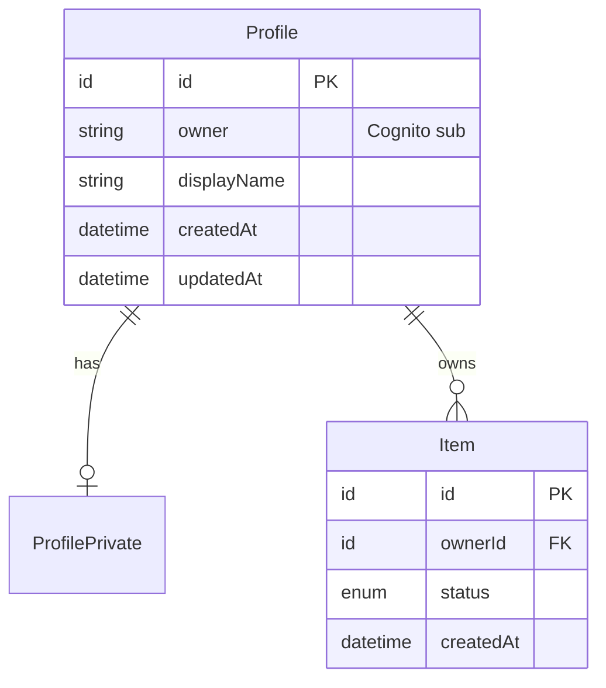

# {Feature Name} - データモデル設計

<!--
  出力先: docs/designs/{feature-name}/data-model.md
  最重要セクション。`a.schema` のモデル定義・認可ルール・アクセスパターン（インデックス）を定義する。

  必須参照:
  - .claude/rules/data-modeling.md - スキーマ設計ルール・破壊的変更の扱い
  - .claude/rules/list-pagination.md - 一覧は nextToken ページング前提
  - .claude/rules/datetime.md - 日時設計ルール
  - .claude/skills/amplify-gen2/ - Amplify Data の実装ガイド
  - frontend/packages/backend/amplify/data/resource.ts - 既存スキーマのパターン

  ⚠️ **DynamoDB は「後からクエリを足す」ができない。**
  RDB なら後から index を張れば済む話が、ここでは
  **アクセスパターンの列挙 → キー設計** を設計時にやり切る必要がある。
  ここを飛ばすと、本番で `filter` 頼みの全走査になり、料金と遅延が線形に増える。
-->

[< architecture.md](./architecture.md) | [api.md >](./api.md)

## アクセスパターン一覧（**最初に埋める**）

<!--
  「誰が」「どのモデルを」「どんな条件で」「どんな順で」取るかを全部列挙する。
  この表が下のインデックス設計とそのまま 1:1 で対応していなければ設計は未完成。

  ⚠️ `filter` は**読み取り後の絞り込み**なので、選択率が低いほど無駄読みと空ページが増える。
  「filter で絞る」と書いた行は、原則インデックスへ移せないか再検討する。
-->

| # | 呼び出し元 | 取りたいもの | 絞り込み条件 | 並び順 | 実現方法 |
|---|---|---|---|---|---|
| 1 | {画面 / 関数} | {Model} の一覧 | {ownerId = 自分} | {createdAt DESC} | `secondaryIndexes`: pk={} / sk={} |
| 2 | | | | | 主キー `get` |

## データ分類マトリクス

<!--
  各モデル/フィールドのデータ分類を定義する。
  この分類が認可ルール（authorization）と PII 分離設計の基礎になる。

  分類基準:
  - public: 誰でもアクセス可能（表示名、公開設定等）
  - internal: 認証ユーザーのみ（内部メタデータ等）
  - confidential: 本人のみ（メールアドレス、電話番号等）
  - restricted: システム / 管理者のみ（決済ID、外部サービスの顧客ID等）
-->

| モデル | フィールド | 分類 | 理由 |
|---|---|---|---|
| {Model} | {field} | public / internal / confidential / restricted | {理由} |

## PII のモデル分離設計

<!--
  個人情報を含むフィールドは、公開されるモデルから分離する。

  ⚠️ **DynamoDB では「列単位の認可」ができない**。認可の単位はモデル（テーブル）である。
  したがって RDB 以上に「分離するかどうか」が効いてくる:
  1 つのモデルに public と confidential を混ぜた時点で、
  そのモデル全体を confidential として扱うしかなくなる。

  分離の判断基準:
  1. 法規制対象のデータ（GDPR / 個人情報保護法） -> 分離必須
  2. 決済・課金関連の ID                          -> 分離必須
  3. 連絡先情報                                    -> 分離推奨
  4. 内部メタデータ                                -> 分離不要
-->

### 分離方針

| 公開モデル | 分離モデル | 分離するフィールド | 理由 |
|---|---|---|---|
| {Model} | {Model}Private | {fields} | PII / 決済情報 |

### 分離パターン

```typescript
// frontend/packages/backend/amplify/data/resource.ts
const schema = a.schema({
  // 公開モデル: 他人も読む情報だけ
  Profile: a
    .model({
      displayName: a.string().required(),
      accountName: a.string().required(),
      avatarPath: a.string(), // ⚠️ 完全な URL ではなく path を保存（storage-images.md §5）
    })
    .authorization((allow) => [
      allow.owner(),                       // 本人は読み書き
      allow.authenticated().to(['read']),  // 他の認証ユーザーは読み取りのみ
    ]),

  // PII モデル: 本人以外は一切読めない
  ProfilePrivate: a
    .model({
      email: a.string().required(),
      phoneNumber: a.string(),
      billingCustomerId: a.string(),
    })
    .authorization((allow) => [allow.owner()]),
})
```

## マルチテナント設計

<!--
  テナント分離の方式を定義する。**DynamoDB に RLS は無い**ので、境界は
  (a) authorization ルール と (b) パーティションキーの設計 の 2 つで作る。
  アプリ層の `if` で代替してはならない（漏れた 1 か所が全部）。

  パターン:
  - B2C: allow.owner() -- Cognito の sub が owner フィールドに入る
  - B2B: allow.groups() / allow.groupDefinedIn('orgId') -- Cognito グループ単位
  - ハイブリッド: 組織で絞ったうえでロールごとに操作を制限
-->

### テナント分離方式

| 方式 | 分離キー | 認可ルール | 適用モデル |
|---|---|---|---|
| B2C | `owner`（Cognito sub） | `allow.owner()` | {モデル一覧} |
| B2B | `organizationId` | `allow.groupDefinedIn('organizationId')` | {モデル一覧} |
| ハイブリッド | `organizationId` + role | 上記 + `.to(['read'])` 等で操作を制限 | {モデル一覧} |

> **認可条件に使う属性は、インデックスのキーにも含める**
> （`.claude/rules/data-modeling.md`）。含めないと「認可で落ちた分だけページが薄くなる」
> 挙動になり、`nextToken` を見ないページングが確実に壊れる。

## ER 図


```mermaid
erDiagram
    Profile ||--o| ProfilePrivate : "has"
    Profile ||--o{ Item : "owns"
    Profile {
        id id PK
        string owner "Cognito sub"
        string displayName
        datetime createdAt
        datetime updatedAt
    }
    Item {
        id id PK
        id ownerId FK
        enum status
        datetime createdAt
    }
```

<!--
  上記は参考パターン。この機能で追加するモデルとリレーションを定義する。
  ⚠️ DynamoDB に外部キー制約は無い。線は「アプリケーション上の関連」であって
  DB が保証する整合性ではない（削除時の連鎖は自分で書く。後述）。
-->

## 日時設計

<!--
  必須参照: .claude/rules/datetime.md

  基本原則:
  - DB / Backend / API: すべて UTC で統一
  - Frontend: 入出力時にのみ UTC <-> ローカル変換
  - スキーマ: a.datetime()（GraphQL の AWSDateTime = ISO 8601・TZ オフセット必須）
-->

| レイヤー | タイムゾーン | 形式 |
|---|---|---|
| DynamoDB | UTC | ISO 8601 文字列（`AWSDateTime`） |
| Backend | UTC | ISO 8601 文字列 |
| API Request/Response | UTC | ISO 8601 文字列 |
| Frontend | 入出力時に UTC <-> ローカル変換 | `Date.toISOString()` / `Intl.DateTimeFormat` |

```typescript
scheduledAt: a.datetime(),   // ✅ "2026-01-15T10:30:00.000Z"
scheduledAt: a.string(),     // ❌ 形式も TZ も検証されない
```

> `createdAt` / `updatedAt` は **Amplify Data が自動で付与**する（UTC ISO 8601）。
> 自分で定義しない。

### この機能の日時フィールド一覧

| モデル | フィールド | 用途 | 備考 |
|---|---|---|---|
| {Model} | {customAt} | {用途} | ソートキーに使うか？ |

## `a.schema` のモデル定義

<!--
  必須ルール（.claude/rules/data-modeling.md より）:

  - **すべてのモデルに `authorization` を書く**（書き忘れは事故に直結する）
  - id は Amplify Data が自動採番する。明示したいときだけ `a.id()`
  - enum は a.enum([...])
  - 一覧に出るモデルは secondaryIndexes を必ず検討する
  - `.required()` を後から足すのは**破壊的変更**（既存行が不正になる）
-->

### モデル定義

```typescript
// frontend/packages/backend/amplify/data/resource.ts
import { a, defineData, type ClientSchema } from '@aws-amplify/backend'

const schema = a.schema({
  {Model}: a
    .model({
      ownerId: a.id().required(),
      status: a.enum(['VALUE1', 'VALUE2', 'VALUE3']),
      title: a.string().required(),
      scheduledAt: a.datetime(),
    })
    // 上の「アクセスパターン一覧」と 1:1 で対応させる
    .secondaryIndexes((index) => [
      index('ownerId').sortKeys(['createdAt']).queryField('list{Model}ByOwner'),
    ])
    .authorization((allow) => [allow.owner()]),
})

export type Schema = ClientSchema<typeof schema>
```

### 型の受け取り方

<!--
  `Schema` は生成ファイルではなく **resource.ts からの型推論**。
  したがって「型を再生成するコマンド」は無い（resource.ts を直すだけ）。
-->

```typescript
import type { Schema } from '@workspace/backend'

type {TypeName} = Schema['{Model}']['type']
```

## 認可ルール設計（RLS の代わり）

<!--
  Amplify Data の authorization は AppSync 側で適用される。
  アプリ層の if 文で代替してはならない（.claude/rules/minimal-implementation.md）。

  よく使う 4 パターン:
  1. allow.owner()                      -- 本人のみ（owner フィールドに Cognito sub が入る）
  2. allow.authenticated().to(['read']) -- 認証ユーザーは読み取りのみ
  3. allow.groups(['admin'])            -- 固定の Cognito グループ
  4. allow.groupDefinedIn('orgId')      -- レコードのフィールドで動的にグループを決める

  サーバー側の書き込み（ワーカー Lambda 等）は **owner ではなく IAM** で通す:
    allow.resource(myFunction)  /  allow.authenticated('identityPool')
-->

### ルール一覧

| モデル | 誰が | 操作 | ルール |
|---|---|---|---|
| {Model} | 本人 | CRUD | `allow.owner()` |
| {Model} | 認証ユーザー | read | `allow.authenticated().to(['read'])` |
| {Model} | 管理者 | update / delete | `allow.groups(['admin'])` |
| {Model} | ワーカー Lambda | update | `allow.resource({fn})` |

### 定義

```typescript
// パターン1: 本人のみ
.authorization((allow) => [allow.owner()])

// パターン2: 本人は書ける / 他の認証ユーザーは読める
.authorization((allow) => [
  allow.owner(),
  allow.authenticated().to(['read']),
])

// パターン3: 組織単位（レコードの organizationId が Cognito グループ名）
.authorization((allow) => [
  allow.groupDefinedIn('organizationId'),
  allow.groups(['admin']),
])

// パターン4: バックグラウンド処理が状態を書き戻す
//   ジョブの「読み取り / 監視」は owner、「書き込み」は関数のロールで行う
//   （.claude/rules/generative-ai.md §3）
.authorization((allow) => [
  allow.owner().to(['read', 'create']),
  allow.resource(worker),
])
```

## 削除時の連鎖（**DB は何もしてくれない**）

<!--
  DynamoDB に ON DELETE CASCADE は無い。
  「親を消したら子も消える」は自分で実装しない限り起きない。

  とくに **アカウント削除**は `deleteUser()` が Cognito ユーザーを消すだけで
  DynamoDB のデータは残る（.claude/rules/auth.md §3.5）。
  「退会したのにデータが残る」は法令・ストア審査の両面でリスクになる。
-->

| 親 | 子 | 消し方 | 実装場所 |
|---|---|---|---|
| {Model} | {ChildModel} | 親削除時に子を列挙して削除 | {関数 / mutation} |
| Cognito ユーザー | owner 認可の全モデル | 削除フローの一部として明示的に削除 | アカウント削除用 Lambda |

## スキーマ変更の影響（**破壊的変更の申告**）

<!--
  必須参照: .claude/rules/data-modeling.md

  ⚠️ 本番でデータが消えるのは以下:
  - フィールドの削除 / リネーム
  - 型の変更
  - 任意 -> 必須（.required()）への変更
  - モデル名の変更
  - パーティションキー / ソートキーの変更（インデックス作り直し）

  sandbox では気づけない（自分のサンドボックスにはデータが無い）。
  **本番反映は必ずユーザー承認**。
-->

| 変更内容 | 破壊的か | 影響 | 対策（移行手順） |
|---|---|---|---|
| {変更1} | はい / いいえ | {影響範囲} | {新フィールドを追加 → 両書き → 移行 → 旧削除 等} |

## 反映手順

```bash
# 1. スキーマ編集
#    frontend/packages/backend/amplify/data/resource.ts

# 2. サンドボックスへ反映（watch 中なら自動）
sandbox

# 3. 型は自動で追従する（Schema は resource.ts からの型推論。生成コマンド不要）

# 4. 本番 / ブランチ環境は Amplify Hosting が amplify.yml に従って
#    ampx pipeline-deploy を実行する（破壊的変更を含むならユーザー承認必須）
```
