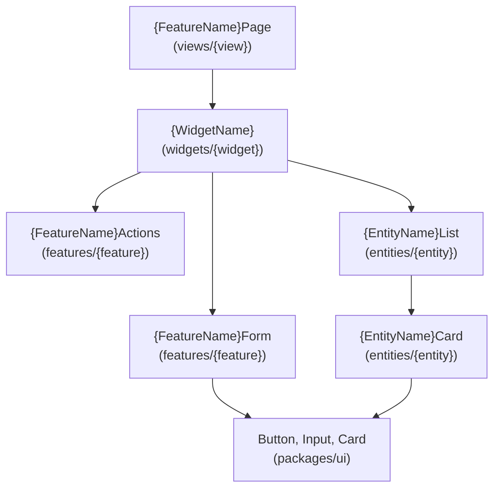

# {Feature Name} - UI/UX 設計

<!--
  出力先: docs/designs/{feature-name}/ui-ux.md
  画面一覧、コンポーネント設計、状態管理、i18n を定義する。

  必須参照:
  - .claude/rules/frontend.md - Frontend コード規約
  - .claude/rules/ui-testing.md - Storybook 必須
  - .claude/rules/datetime.md - 日時表示ルール
  - .claude/skills/fsd/SKILL.md - FSD 構造
  - .claude/skills/storybook/SKILL.md - Storybook 10
  - .claude/skills/i18n/SKILL.md - next-intl
  - .claude/skills/shadcn-ui/ - shadcn/ui (Web)
  - .claude/skills/gluestack/ - gluestack-ui (Mobile)
-->

[< api.md](./api.md) | [security.md >](./security.md)

---

## Web (Next.js) 設計

### 画面一覧

<!--
  この機能で追加する画面（ページ/ビュー）を列挙する。
  Next.js App Router のルーティング構造と FSD views レイヤーの対応を示す。
-->

| # | 画面名 | ルート | FSD View | 認証 | 説明 |
|---|--------|--------|----------|------|------|
| 1 | {画面名} | `/[locale]/{path}` | views/{view-name} | 要 | {説明} |
| 2 | {画面名} | `/[locale]/{path}/[id]` | views/{view-name} | 要 | {説明} |

### ルーティング構造

```
frontend/apps/web/app/[locale]/
├── {path}/
│   ├── page.tsx         -> views/{view-name}
│   └── [id]/
│       └── page.tsx     -> views/{detail-view-name}
```

### ワイヤーフレーム

<!--
  主要画面のレイアウトを ASCII art または Mermaid で表現する。
  詳細なデザインではなく、コンポーネントの配置と構造を示す。
-->

#### {画面名}

```
+------------------------------------------+
| Header (Widget: app-shell)               |
+------------------------------------------+
| Sidebar    | Main Content                |
| (Widget)   |                             |
|            | +------------------------+  |
|            | | {Feature} Form         |  |
|            | | (Feature Component)    |  |
|            | +------------------------+  |
|            |                             |
|            | +------------------------+  |
|            | | {Entity} List          |  |
|            | | (Entity Component)     |  |
|            | +------------------------+  |
+------------------------------------------+
```

### Web コンポーネント設計

<!--
  FSD レイヤーに基づくコンポーネント配置を定義する。

  ルール:
  - UI コンポーネント -> Storybook 必須、単体テスト不要
  - ビジネスロジック（model/api） -> 単体テスト必須 (TDD)
  - 共通 UI -> packages/ui/ または shared/ui/
  - UI ライブラリ: shadcn/ui (Radix UI + TailwindCSS 4)
-->

#### コンポーネント階層



#### コンポーネント一覧

| コンポーネント | FSD配置 | 種別 | Storybook | 単体テスト |
|--------------|---------|------|-----------|-----------|
| {FeatureName}Page | views/{view}/ui/ | Server Component | - | - |
| {WidgetName} | widgets/{widget}/ui/ | Client Component | 必須 | 不要 |
| {FeatureName}Form | features/{feature}/ui/ | Client Component | 必須 | 不要 |
| {EntityName}Card | entities/{entity}/ui/ | Client Component | 必須 | 不要 |
| use{FeatureName} | features/{feature}/model/ | Hook | - | 必須 (TDD) |
| use{Entity}List | entities/{entity}/api/ | Hook | - | 必須 (TDD) |

### Storybook ストーリー計画 (Web)

<!--
  参照: .claude/skills/storybook/SKILL.md

  ルール:
  - title は FSD 構造に準拠: "apps/web/{layer}/{slice}/{Component}"
  - fn() は storybook/test からインポート
  - 最低限: Default, Loading, Error, Empty の4バリエーション
-->

```typescript
// entities/{entity}/ui/{EntityName}Card.stories.tsx
import type { Meta, StoryObj } from '@storybook/react'
import { fn } from 'storybook/test'
import { {EntityName}Card } from './{EntityName}Card'

const meta = {
  title: 'apps/web/entities/{entity}/{EntityName}Card',
  component: {EntityName}Card,
  tags: ['autodocs'],
  args: {
    onClick: fn(),
  },
} satisfies Meta<typeof {EntityName}Card>

export default meta
type Story = StoryObj<typeof meta>

export const Default: Story = {
  args: {
    // ... default props
  },
}

export const Loading: Story = {
  args: { isLoading: true },
}

export const Error: Story = {
  args: { error: 'エラーが発生しました' },
}

export const Empty: Story = {
  args: { data: null },
}
```

---

## Mobile (Expo) 設計

<!--
  この機能で Mobile 対応が必要な場合に記載する。
  不要な場合: N/A -- この機能では Mobile 対応は行わない

  参照:
  - .claude/rules/frontend.md - Mobile セクション
  - .claude/skills/gluestack/ - gluestack-ui + NativeWind
-->

### Mobile 画面一覧

| # | 画面名 | Expo Router パス | 認証 | 説明 |
|---|--------|-----------------|------|------|
| 1 | {画面名} | `/(tabs)/{path}` | 要 | {説明} |
| 2 | {画面名} | `/(modals)/{path}` | 要 | {説明} |

### ナビゲーション構造 (Expo Router)

```
frontend/apps/mobile/app/
├── (tabs)/
│   ├── {tab-name}/
│   │   ├── index.tsx        -> メイン画面
│   │   └── [id].tsx         -> 詳細画面
│   └── _layout.tsx          -> タブレイアウト
├── (modals)/
│   └── {modal-name}.tsx     -> モーダル画面
└── _layout.tsx              -> ルートレイアウト
```

### Mobile コンポーネント設計

<!--
  UI ライブラリ: gluestack-ui + NativeWind 5 (tva)
  アイコン: lucide-react-native
-->

| コンポーネント | 配置 | gluestack コンポーネント | 説明 |
|--------------|------|----------------------|------|
| {Component} | features/{feature}/ui/ | Box, Text, Button, Input | {説明} |
| {Component} | entities/{entity}/ui/ | Card, HStack, VStack | {説明} |

### プラットフォーム分岐

<!--
  Web と Mobile で異なる実装が必要な場合のみ記載。
  共通ロジック（model/, api/）は packages/ で共有可能。
-->

| 機能 | Web | Mobile | 共通 |
|------|-----|--------|------|
| UI コンポーネント | shadcn/ui | gluestack-ui | - |
| スタイリング | TailwindCSS 4 (className) | NativeWind 5 (tva) | デザイントークン (packages/tokens) |
| ナビゲーション | Next.js App Router | Expo Router | - |
| データ取得 | - | - | TanStack Query + supabase-js |
| 状態管理 | - | - | Zustand |

---

## 状態管理設計

<!--
  参照: .claude/skills/tanstack-query/SKILL.md

  役割分担:
  - ローカルUI状態: useState (フォーム入力、モーダル開閉)
  - グローバル共有状態: Zustand (認証セッション)
  - サーバー状態: TanStack Query (DBデータ、API応答)

  このセクションが architecture.md の状態管理の正（Single Source of Truth）。
-->

| 状態 | 種別 | 管理方法 | 配置場所 |
|------|------|---------|---------|
| {entity}一覧 | サーバー状態 | TanStack Query | entities/{entity}/api/queries.ts |
| {entity}詳細 | サーバー状態 | TanStack Query | entities/{entity}/api/queries.ts |
| フォーム入力 | ローカルUI | useState | features/{feature}/ui/{Component}.tsx |
| モーダル開閉 | ローカルUI | useState | features/{feature}/ui/{Component}.tsx |
| {global}状態 | グローバル | Zustand | entities/{entity}/model/store.ts |

### Query Key 設計

```typescript
export const {entity}Keys = {
  all: ['{entities}'] as const,
  lists: () => [...{entity}Keys.all, 'list'] as const,
  list: (filters: string) => [...{entity}Keys.lists(), filters] as const,
  details: () => [...{entity}Keys.all, 'detail'] as const,
  detail: (id: string) => [...{entity}Keys.details(), id] as const,
}
```

## 日時表示パターン

<!--
  参照: .claude/rules/datetime.md

  基本原則:
  - API からは UTC (ISO 8601) で受け取る
  - フロントエンドの useEffect 内でのみローカルタイムゾーンに変換
  - Server Component で toLocaleString() を使用しない（ハイドレーションエラーの原因）
-->

### 日時変換ルール

| コンテキスト | 変換方法 | 禁止事項 |
|------------|---------|---------|
| Server Component | ISO文字列をそのまま渡す | `toLocaleString()` 禁止 |
| Client Component | `useEffect` 内で `Intl.DateTimeFormat` | useEffect 外での TZ 変換禁止 |
| フォーム入力 | `Date.toISOString()` で UTC に変換して送信 | ローカル時刻のまま送信禁止 |

### 日時表示コンポーネント

```typescript
'use client'

export function DateDisplay({ utcDate }: { utcDate: string }) {
  const [formatted, setFormatted] = useState('')

  useEffect(() => {
    const date = new Date(utcDate)
    setFormatted(
      new Intl.DateTimeFormat('ja-JP', {
        year: 'numeric',
        month: 'long',
        day: 'numeric',
        hour: '2-digit',
        minute: '2-digit',
        timeZone: Intl.DateTimeFormat().resolvedOptions().timeZone,
      }).format(date)
    )
  }, [utcDate])

  if (!formatted) return <time>Loading...</time>
  return <time dateTime={utcDate}>{formatted}</time>
}
```

### この機能の日時表示箇所

| 画面 | 表示箇所 | フォーマット | タイムゾーン変換 |
|------|---------|------------|----------------|
| {画面} | {箇所} | {フォーマット} | useEffect 内 |

## i18n 設計

<!--
  参照: .claude/skills/i18n/SKILL.md

  ルール:
  - すべてのユーザー向けテキストは i18n 必須
  - en/ja 両方のメッセージファイルに追加
  - 名前空間はコンポーネント名/機能名に合わせる
  - Server Component: getTranslations()
  - Client Component: useTranslations()
-->

### メッセージキー

```json
// frontend/apps/web/src/shared/config/i18n/messages/en.json に追加
{
  "{FeatureName}": {
    "title": "{Title in English}",
    "description": "{Description in English}",
    "form": {
      "nameLabel": "Name",
      "namePlaceholder": "Enter name",
      "submitButton": "Create",
      "cancelButton": "Cancel"
    },
    "list": {
      "empty": "No items found",
      "loading": "Loading..."
    },
    "error": {
      "notFound": "Not found",
      "unauthorized": "You don't have permission"
    }
  }
}
```

```json
// frontend/apps/web/src/shared/config/i18n/messages/ja.json に追加
{
  "{FeatureName}": {
    "title": "{日本語タイトル}",
    "description": "{日本語説明}",
    "form": {
      "nameLabel": "名前",
      "namePlaceholder": "名前を入力",
      "submitButton": "作成",
      "cancelButton": "キャンセル"
    },
    "list": {
      "empty": "アイテムが見つかりません",
      "loading": "読み込み中..."
    },
    "error": {
      "notFound": "見つかりません",
      "unauthorized": "権限がありません"
    }
  }
}
```

### 使用例

```typescript
// Server Component
import { getTranslations } from 'next-intl/server'

export default async function {FeatureName}Page() {
  const t = await getTranslations('{FeatureName}')
  return <h1>{t('title')}</h1>
}

// Client Component
'use client'
import { useTranslations } from 'next-intl'

export function {FeatureName}Form() {
  const t = useTranslations('{FeatureName}.form')
  return (
    <form>
      <Label>{t('nameLabel')}</Label>
      <Input placeholder={t('namePlaceholder')} />
      <Button>{t('submitButton')}</Button>
    </form>
  )
}
```

## レスポンシブ設計

<!--
  shadcn/ui + TailwindCSS 4 によるレスポンシブ対応。
  Storybook の Viewport ツールで確認（MobileView Story は作成しない）。
-->

| ブレークポイント | 幅 | レイアウト |
|----------------|-----|----------|
| Mobile | < 768px | シングルカラム |
| Tablet | 768px - 1024px | 2カラム |
| Desktop | > 1024px | サイドバー + メイン |

## アクセシビリティ

<!-- WCAG 2.1 AA 準拠の要件 -->

| 要件 | 対応方法 |
|------|---------|
| キーボードナビゲーション | Radix UI プリミティブ使用 |
| スクリーンリーダー | aria-label, aria-describedby |
| カラーコントラスト | CSS変数（theme対応） |
| フォーカス管理 | focus-visible リング |
